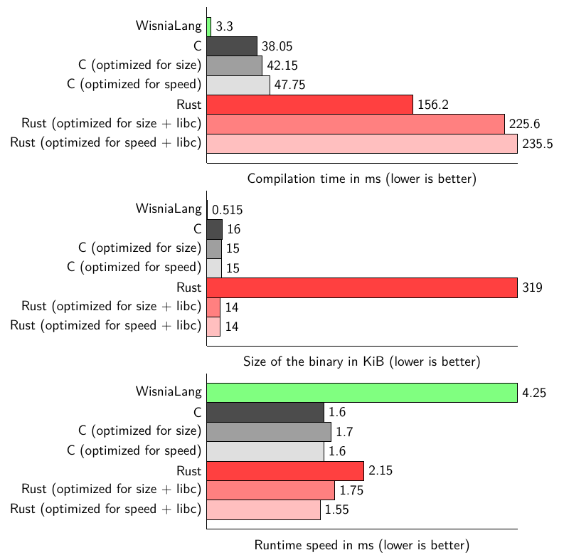

# WisniaLang

[](https://github.com/belijzajac/WisniaLang/actions/workflows/tests.yml)
[](https://codecov.io/gh/belijzajac/WisniaLang)
[](LICENSE)

## Dependencies

* C++20 compatible compiler
* CMake

## Building from source

```bash
mkdir build && cd build
cmake -DCMAKE_BUILD_TYPE=Release ..
make -j$(nproc) wisnia
```

## Debugging binaries

```gdb
(gdb) set disassembly-flavor intel
(gdb) layout asm
(gdb) layout reg
(gdb) b *0x4000b0
(gdb) r
```

## Example programs

Can be found in [tests/programs/ProgramTest.cpp](tests/programs/ProgramTest.cpp) file.

## Benchmarks

[](https://belijzajac.dev/wisnialang-compiler-project/)

> However, it’s important to acknowledge that the runtime range for WisniaLang was 84.0 µs to 736.3 µs over 1000 program runs, indicating ambiguous results due to benchmarking a program of less than 20 lines of code. In the real world, to accurately assess a compiler backend’s performance, one would need to run benchmarks on millions of lines of code.

## License

This project is available under the [GPLv3 license](LICENSE).
